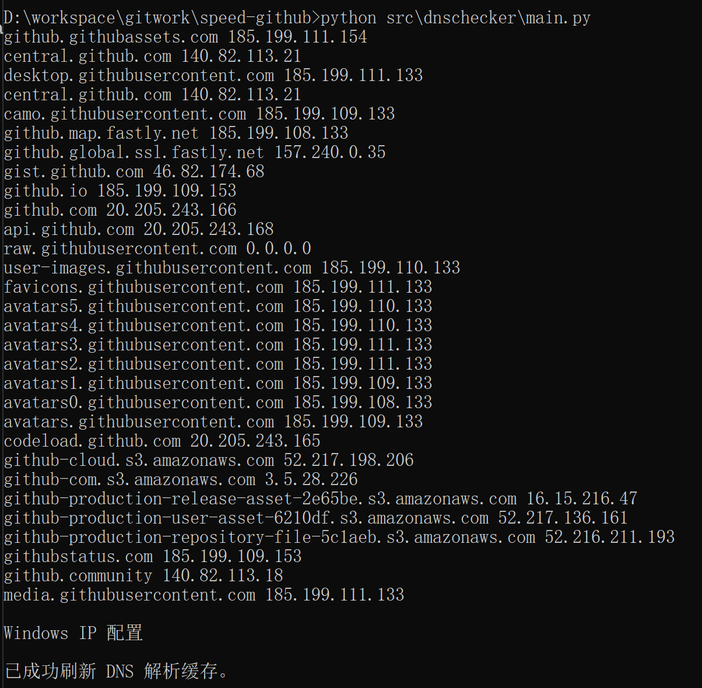

<div align="center"> </div>

<p align="center" style="padding:10px 6px">
  
   
  
  


# speed-github

一个解决github在国内加载和下载速度慢问题的工具

### 速度慢原因

CDN，Content Distribute Network，可以直译成内容分发网络，CDN解决的是如何将数据快速可靠从源站传递到用户的问题。

用户获取数据时，不需要直接从源站获取，通过CDN对于数据的分发，用户可以从一个较优的服务器获取数据，从而达到快速访问，并减少源站负载压力的目的。

处于某些原因的考虑，Github在国内被限制的访问。其手段主要是通过DNS污染，就是通过向DNS服务器其中注入github错误的IP地址，从而影响用户访问。


### 如何解决

将github相关的域名解析成正确的ip, 然后填入本地的host文件中。当用户访问github时就不会再从DNS服务器解析ip, 而是使用本地的正确ip，也就不受DNS污染影响。

<pre>
<code>
github.githubassets.com
central.github.com
desktop.githubusercontent.com
central.github.com
camo.githubusercontent.com
github.map.fastly.net
github.global.ssl.fastly.net
gist.github.com
github.io
github.com
api.github.com
raw.githubusercontent.com
user-images.githubusercontent.com
favicons.githubusercontent.com
avatars5.githubusercontent.com
avatars4.githubusercontent.com
avatars3.githubusercontent.com
avatars2.githubusercontent.com
avatars1.githubusercontent.com
avatars0.githubusercontent.com
avatars.githubusercontent.com
codeload.github.com
github-cloud.s3.amazonaws.com
github-com.s3.amazonaws.com
github-production-release-asset-2e65be.s3.amazonaws.com
github-production-user-asset-6210df.s3.amazonaws.com
github-production-repository-file-5c1aeb.s3.amazonaws.com
githubstatus.com
github.community
media.githubusercontent.com
</code>
</pre>

将获取的ip与对应的网址填入host文件中，然后刷新本地DNS.


### 运行环境

- python3+
- 依赖库
	- dnspython
	- shutil

### 使用方式
 ```sh
	pip install -r requirements.txt

	python ./src/main.py
 ```


### 效果图



### 关于

该项目从第一次发布之后到这一次更新，隔了有好几年的时间，未来该项目将会持续更新。后续在使用过程中，如果有什么问题，欢迎提issue，我也会及时跟进。
